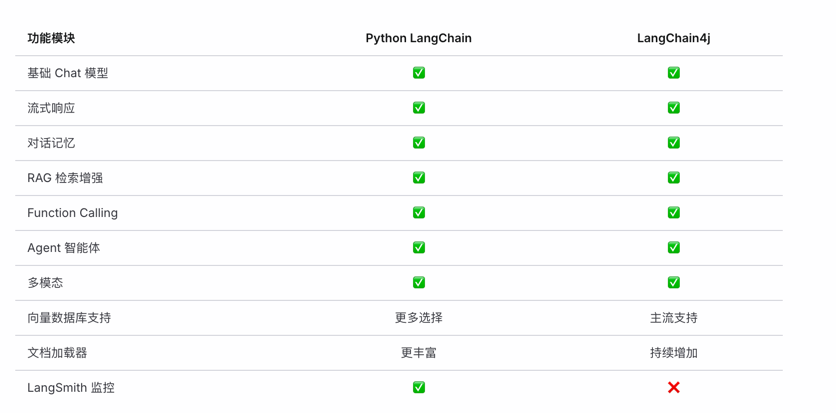
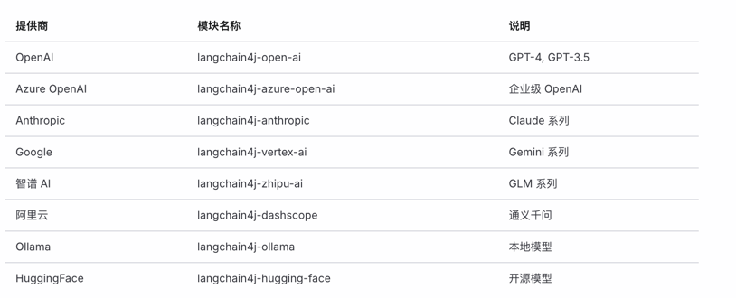
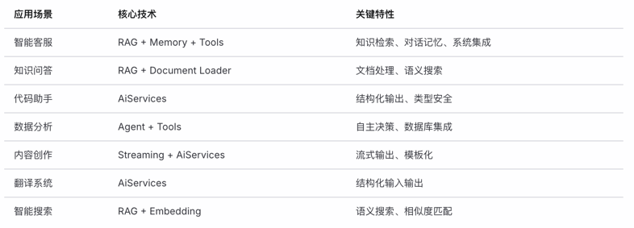
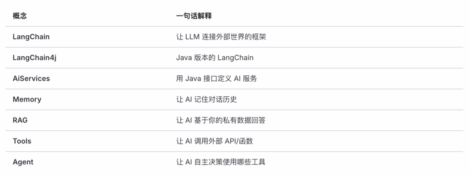

# Day 1：认识 LangChain4j

## 📚 今日学习目标

通过今天的学习，你将能够：
- 理解 LangChain 和 LangChain4j 的概念与定位
- 明确 LangChain4j 与 Python LangChain 的关系与区别
- 掌握 LangChain4j 的核心特性
- 了解 LangChain4j 的适用场景
- 熟悉官方文档结构，为后续学习打好基础

---

## 一、什么是 LangChain？

### 1.1 LangChain 的诞生背景

随着 ChatGPT 等大语言模型（LLM）的爆发式发展，开发者面临着一系列挑战：

| 挑战 | 描述 |
|:-----|:-----|
| **API 调用复杂** | 不同模型提供商的 API 格式各异 |
| **上下文管理困难** | LLM 本身无状态，需要手动管理对话历史 |
| **知识局限性** | 模型知识有截止日期，无法获取实时或私有数据 |
| **能力边界** | LLM 无法执行代码、访问数据库、调用外部服务 |
| **输出不可控** | 模型输出格式不固定，难以集成到应用程序 |

### 1.2 LangChain 是什么？

**LangChain** 是一个用于开发 **LLM 驱动应用程序** 的开源框架。

> 🎯 **核心理念**：将大语言模型与外部数据源、工具、记忆系统等组件"链接"（Chain）起来，构建更强大的 AI 应用。

┌─────────────────────────────────────────────────────────────┐
│ LangChain 框架 │
├─────────────────────────────────────────────────────────────┤
│ │
│ ┌─────────┐ ┌─────────┐ ┌─────────┐ ┌─────────┐ │
│ │ 模型 │ │ 记忆 │ │ 工具 │ │ 数据 │ │
│ │ Models │ + │ Memory │ + │ Tools │ + │ Data │ │
│ └─────────┘ └─────────┘ └─────────┘ └─────────┘ │
│ ↓ │
│ ┌─────────────────────┐ │
│ │ 强大的 AI 应用 │ │
│ └─────────────────────┘ │
└─────────────────────────────────────────────────────────────┘


### 1.3 LangChain 的核心组件

| 组件 | 作用 | 示例 |
|:-----|:-----|:-----|
| **Models** | 统一的模型调用接口 | OpenAI、Claude、通义千问 |
| **Prompts** | 提示词模板与管理 | 动态生成提示词 |
| **Memory** | 对话记忆管理 | 记住用户之前说的话 |
| **Chains** | 组合多个操作 | 先检索再生成 |
| **Agents** | 自主决策执行任务 | 根据需要调用不同工具 |
| **RAG** | 检索增强生成 | 基于私有文档回答问题 |

---

## 二、什么是 LangChain4j？

### 2.1 LangChain4j 定义

**LangChain4j** 是 LangChain 理念在 **Java 生态系统** 中的实现。

> 📌 官方定义：LangChain4j 是一个 Java 库，旨在简化将大语言模型（LLM）集成到 Java 应用程序中的过程。

┌────────────────────────────────────────────────────────────┐
│ │
│ Python 开发者 ───────→ LangChain (Python) │
│ │
│ Java 开发者 ───────→ LangChain4j (Java) │
│ │
│ JavaScript 开发者 ────→ LangChain.js │
│ │
└────────────────────────────────────────────────────────────┘


### 2.2 为什么需要 LangChain4j？

#### 企业级 Java 应用的现实需求

┌─────────────────────────────────────────────────────────────┐
│ 企业现有技术栈 │
├─────────────────────────────────────────────────────────────┤
│ ┌──────────────┐ ┌──────────────┐ ┌──────────────┐ │
│ │ Spring Boot │ │ MyBatis │ │ Redis │ │
│ └──────────────┘ └──────────────┘ └──────────────┘ │
│ ┌──────────────┐ ┌──────────────┐ ┌──────────────┐ │
│ │ MySQL │ │ Kubernetes │ │ 微服务 │ │
│ └──────────────┘ └──────────────┘ └──────────────┘ │
│ │
│ 需要集成 AI 能力 │
│ ↓ │
│ ┌─────────────────────┐ │
│ │ LangChain4j │ │
│ │ 无缝集成到 Java 生态 │ │
│ └─────────────────────┘ │
└─────────────────────────────────────────────────────────────┘


#### 选择 LangChain4j 的理由

| 理由 | 说明 |
|:-----|:-----|
| **Java 原生** | 充分利用 Java 类型安全、面向对象等特性 |
| **Spring 友好** | 提供 Spring Boot Starter，无缝集成 |
| **企业级支持** | 适合大型企业应用，易于维护和扩展 |
| **团队技能复用** | Java 团队无需学习 Python |
| **生态兼容** | 与现有 Java 中间件、框架完美配合 |

### 2.3 LangChain4j 项目信息

| 项目信息 | 内容 |
|:---------|:-----|
| **开源协议** | Apache 2.0 |
| **GitHub 地址** | https://github.com/langchain4j/langchain4j |
| **官方文档** | https://docs.langchain4j.dev/ |
| **最低 JDK 版本** | JDK 8（推荐 JDK 17+） |
| **当前版本** | 0.36.x（截至 2024 年底，版本迭代较快） |
| **核心维护者** | Dmytro Liubarskyi 等 |

---

## 三、LangChain4j 与 Python LangChain 的关系与区别

### 3.1 关系

┌─────────────────────────────────────────────────────────────┐
│ 共同理念 │
│ │
│ "让开发者更容易构建 LLM 驱动的应用程序" │
│ │
├─────────────────────────────────────────────────────────────┤
│ │
│ ┌─────────────────┐ ┌─────────────────┐ │
│ │ LangChain │ 启发参考 │ LangChain4j │ │
│ │ (Python) │ ───────────→ │ (Java) │ │
│ │ │ │ │ │
│ │ 2022 年诞生 │ │ 2023 年诞生 │ │
│ └─────────────────┘ └─────────────────┘ │
│ │
│ ⚠️ 注意：LangChain4j 不是 LangChain 的官方 Java 移植版 │
│ 而是独立项目，借鉴了 LangChain 的设计理念 │
│ │
└─────────────────────────────────────────────────────────────┘


### 3.2 核心区别对比

| 对比维度 | LangChain (Python) | LangChain4j (Java) |
|:---------|:-------------------|:-------------------|
| **编程语言** | Python | Java |
| **类型系统** | 动态类型 | 静态类型，编译时检查 |
| **API 设计** | 链式调用，装饰器模式 | 接口驱动，注解配置 |
| **框架集成** | FastAPI、Flask | Spring Boot、Quarkus |
| **社区规模** | 更大，资源更丰富 | 快速增长中 |
| **更新速度** | 非常快，API 变动频繁 | 相对稳定 |
| **生态成熟度** | 更成熟 | 快速追赶中 |
| **企业采用** | 初创公司居多 | 传统企业更倾向 |

### 3.3 代码风格对比

#### Python LangChain 示例

```python
# Python LangChain 风格
from langchain.chat_models import ChatOpenAI
from langchain.schema import HumanMessage

chat = ChatOpenAI(temperature=0.7)
response = chat([HumanMessage(content="你好")])
print(response.content)
```

#### Java LangChain4j 示例

```java
// Java LangChain4j 风格
ChatLanguageModel model = OpenAiChatModel.builder()
    .apiKey("your-api-key")
    .temperature(0.7)
    .build();

String response = model.generate("你好");
System.out.println(response);
```

### 3.4 功能覆盖对比




## 四、LangChain4j 核心特性概览

### 4.1 架构总览

┌─────────────────────────────────────────────────────────────────┐
│                        LangChain4j 架构                          │
├─────────────────────────────────────────────────────────────────┤
│                                                                 │
│  ┌───────────────────────────────────────────────────────────┐ │
│  │                     High-Level API                        │ │
│  │  ┌─────────────┐  ┌─────────────┐  ┌─────────────────┐   │ │
│  │  │ AiServices  │  │   EasyRAG   │  │  Chains/Agents  │   │ │
│  │  │  (声明式)   │  │  (快速RAG)  │  │   (编排组合)    │   │ │
│  │  └─────────────┘  └─────────────┘  └─────────────────┘   │ │
│  └───────────────────────────────────────────────────────────┘ │
│                              ↓                                  │
│  ┌───────────────────────────────────────────────────────────┐ │
│  │                      Low-Level API                        │ │
│  │  ┌───────────┐ ┌───────────┐ ┌───────────┐ ┌───────────┐ │ │
│  │  │ChatModel  │ │Embedding  │ │ Document  │ │  Memory   │ │ │
│  │  │           │ │  Model    │ │  Loader   │ │           │ │ │
│  │  └───────────┘ └───────────┘ └───────────┘ └───────────┘ │ │
│  └───────────────────────────────────────────────────────────┘ │
│                              ↓                                  │
│  ┌───────────────────────────────────────────────────────────┐ │
│  │                    模型提供商集成                          │ │
│  │  OpenAI | Azure | Anthropic | 智谱 | 通义 | Ollama | ... │ │
│  └───────────────────────────────────────────────────────────┘ │
│                                                                 │
└─────────────────────────────────────────────────────────────────┘


### 4.2 核心特性详解

#### 特性 1：统一的模型抽象

┌─────────────────────────────────────────────────────────────┐
│                    ChatLanguageModel 接口                    │
│                                                             │
│                    ┌─────────────────┐                      │
│                    │ ChatLanguageModel│                      │
│                    └────────┬────────┘                      │
│                             │                               │
│           ┌─────────────────┼─────────────────┐             │
│           ↓                 ↓                 ↓             │
│   ┌──────────────┐ ┌──────────────┐ ┌──────────────┐       │
│   │OpenAiChatModel│ │QwenChatModel │ │OllamaChatModel│       │
│   └──────────────┘ └──────────────┘ └──────────────┘       │
│                                                             │
│   一套代码，轻松切换不同模型提供商                            │
└─────────────────────────────────────────────────────────────┘

##### 支持的模型提供商




#### 特性 2：AiServices 声明式 AI 服务

```java
// 定义接口，描述 AI 服务行为
interface Assistant {
    
    @SystemMessage("你是一个友好的助手")
    String chat(String userMessage);
    
    @SystemMessage("你是一个翻译专家")
    String translate(@UserMessage String text, 
                     @V("targetLang") String targetLanguage);
}

// 创建实例，自动实现
Assistant assistant = AiServices.create(Assistant.class, chatModel);

// 像调用普通 Java 方法一样使用 AI
String response = assistant.chat("你好");
```

##### 优势：

- ✅ 类型安全
- ✅ 代码清晰
- ✅ 易于测试
- ✅ IDE 友好


#### 特性 3：结构化输出

```java
// 定义返回结构
record BookRecommendation(
    String title,
    String author,
    String reason
) {}

interface BookAdvisor {
    @UserMessage("推荐一本关于 {{topic}} 的书")
    BookRecommendation recommend(@V("topic") String topic);
}

// 自动解析为 Java 对象
BookRecommendation book = advisor.recommend("Java 编程");
System.out.println(book.title());   // 直接访问属性
System.out.println(book.author());
```

#### 特性 4：对话记忆

┌─────────────────────────────────────────────────────────────┐
│                       ChatMemory                             │
│                                                             │
│   ┌─────────────────────────────────────────────────────┐   │
│   │ User: 我叫张三                                       │   │
│   │ AI: 你好张三，很高兴认识你！                          │   │
│   │ User: 我喜欢打篮球                                   │   │
│   │ AI: 打篮球是很好的运动！                             │   │
│   │ User: 还记得我的名字吗？                             │   │
│   │ AI: 当然记得，你叫张三，你喜欢打篮球！               │   │ ← 记忆生效
│   └─────────────────────────────────────────────────────┘   │
│                                                             │
│   支持：窗口记忆、Token 限制记忆、持久化记忆                  │
└─────────────────────────────────────────────────────────────┘

#### 特性 5：RAG 检索增强生成

┌─────────────────────────────────────────────────────────────┐
│                      RAG 工作流程                            │
│                                                             │
│  ┌──────────┐    ┌──────────┐    ┌──────────┐              │
│  │  文档    │ →  │  分块    │ →  │ Embedding │              │
│  │ 加载    │    │ 切分    │    │  向量化   │              │
│  └──────────┘    └──────────┘    └──────────┘              │
│                                       ↓                     │
│                              ┌──────────────┐               │
│                              │  向量数据库   │               │
│                              │   存储索引   │               │
│                              └──────────────┘               │
│                                       ↓                     │
│  ┌──────────┐    ┌──────────┐    ┌──────────┐              │
│  │  用户    │ →  │  检索    │ →  │  增强    │ → 回答       │
│  │  提问    │    │ 相关文档 │    │  Prompt  │              │
│  └──────────┘    └──────────┘    └──────────┘              │
│                                                             │
└─────────────────────────────────────────────────────────────┘


#### 特性 6：Tools 工具调用

```java
// 定义工具
class WeatherTools {
    
    @Tool("查询指定城市的天气")
    String getWeather(@P("城市名称") String city) {
        // 调用天气 API
        return weatherApi.query(city);
    }
    
    @Tool("查询航班信息")
    String getFlight(@P("出发城市") String from, 
                     @P("到达城市") String to) {
        return flightApi.search(from, to);
    }
}

// AI 会自动判断何时调用哪个工具
// User: "北京今天天气怎么样？" → AI 自动调用 getWeather("北京")
```

#### 特性 7：流式响应

```java
// 流式输出，实时显示生成内容
model.generate("写一篇关于春天的文章")
    .onNext(token -> System.out.print(token))  // 逐字输出
    .onComplete(response -> System.out.println("\n完成"))
    .onError(error -> error.printStackTrace())
    .start();
```


### 4.3 模块化设计

langchain4j/
├── langchain4j-core                 # 核心抽象与接口
├── langchain4j                      # 高级 API（AiServices 等）
│
├── langchain4j-open-ai              # OpenAI 集成
├── langchain4j-azure-open-ai        # Azure OpenAI 集成
├── langchain4j-anthropic            # Claude 集成
├── langchain4j-zhipu-ai             # 智谱 GLM 集成
├── langchain4j-dashscope            # 通义千问集成
├── langchain4j-ollama               # 本地模型 Ollama
│
├── langchain4j-embeddings-*         # 各种 Embedding 模型
│
├── langchain4j-chroma               # Chroma 向量数据库
├── langchain4j-milvus               # Milvus 向量数据库
├── langchain4j-pgvector             # PostgreSQL 向量扩展
├── langchain4j-redis                # Redis 向量搜索
│
├── langchain4j-document-parser-*    # 文档解析器
│
├── langchain4j-spring-boot-starter  # Spring Boot 集成
└── langchain4j-quarkus              # Quarkus 集成


## 五、适用场景分析

### 5.1 典型应用场景

#### 场景 1：智能客服系统

┌─────────────────────────────────────────────────────────────┐
│                      智能客服系统                            │
│                                                             │
│   用户提问 ──→ 意图识别 ──→ 知识库检索 ──→ 生成回答         │
│                    ↓                                        │
│              需要人工？ ──→ 转接人工客服                     │
│                                                             │
│   技术栈：AiServices + RAG + Memory + Tools                │
└─────────────────────────────────────────────────────────────┘

**适用能力：**

- 多轮对话记忆
- 知识库检索（RAG）
- 工单系统集成（Tools）

#### 场景 2：企业知识库问答
┌─────────────────────────────────────────────────────────────┐
│                    企业知识库问答                            │
│                                                             │
│  ┌─────────────┐                                            │
│  │ 内部文档    │                                            │
│  │ PDF/Word    │ ──→ 向量化存储 ──→ 语义检索 ──→ 精准回答   │
│  │ 规章制度    │                                            │
│  └─────────────┘                                            │
│                                                             │
│  "员工年假政策是什么？" → 自动从文档中找到答案              │
│                                                             │
│   技术栈：Document Loader + RAG + EasyRAG                  │
└─────────────────────────────────────────────────────────────┘

#### 场景 3：代码助手
┌─────────────────────────────────────────────────────────────┐
│                      代码助手                                │
│                                                             │
│  • 代码生成：根据描述生成代码                                │
│  • 代码解释：解释复杂代码逻辑                                │
│  • 代码审查：发现潜在问题                                    │
│  • 单测生成：自动生成单元测试                                │
│                                                             │
│   技术栈：AiServices + 结构化输出                           │
└─────────────────────────────────────────────────────────────┘

#### 场景 4：数据分析助手
┌─────────────────────────────────────────────────────────────┐
│                    数据分析助手                              │
│                                                             │
│  用户：上个月销售额最高的产品是什么？                        │
│                     ↓                                       │
│  AI Agent：                                                 │
│    1. 理解用户意图                                          │
│    2. 生成 SQL 查询                                         │
│    3. 执行数据库查询 ←── Tools                              │
│    4. 分析结果                                              │
│    5. 生成自然语言回答                                      │
│                                                             │
│   技术栈：Agent + Tools（数据库查询）                       │
└─────────────────────────────────────────────────────────────┘

#### 场景 5：内容创作平台
┌─────────────────────────────────────────────────────────────┐
│                    内容创作平台                              │
│                                                             │
│  • 文章生成：给定主题生成文章                                │
│  • 文案优化：改进营销文案                                    │
│  • 多语言翻译：高质量翻译                                    │
│  • 摘要生成：长文本摘要                                      │
│                                                             │
│   技术栈：AiServices + Streaming                            │
└─────────────────────────────────────────────────────────────┘

### 5.2 场景与技术映射



### 5.3 选择 LangChain4j 的判断标准

**✅ 适合使用 LangChain4j 的情况：**

- 团队主要技术栈是 Java
- 需要与现有 Spring 应用集成
- 企业级应用，需要类型安全和可维护性
- 需要构建复杂的 AI 工作流
- 需要集成私有知识库
- 需要让 AI 调用外部工具/API

**❌ 可能不需要 LangChain4j 的情况：**

- 只需要简单调用 LLM API（直接用 HTTP 客户端即可）
- 团队更熟悉 Python（使用 Python LangChain）
- 快速原型验证（Python 可能更快）


## 六、官方文档导读

### 6.1 官方资源汇总

| 资源 | 地址 | 说明 |
|:-----|:-----|:-----|
| **官方文档** | https://docs.langchain4j.dev/ | 最权威的学习资料 |
| **GitHub** | https://github.com/langchain4j/langchain4j | 源码与 Issues |
| **示例代码** | https://github.com/langchain4j/langchain4j-examples | 丰富的示例 |
| **Discord** | 官网获取链接 | 社区交流 |

### 6.2 文档结构导航
```text
docs.langchain4j.dev/
│
├── Get Started（入门）
│   ├── Introduction ←── 从这里开始
│   ├── Getting Started
│   └── Spring Boot Integration
│
├── Tutorials（教程）
│   ├── Chat and Language Models
│   ├── Chat Memory
│   ├── Response Streaming
│   ├── AI Services
│   ├── RAG
│   ├── Tools (Function Calling)
│   └── ...
│
├── Integrations（集成）
│   ├── Language Models
│   │   ├── OpenAI
│   │   ├── Azure OpenAI
│   │   ├── Anthropic (Claude)
│   │   └── ...
│   ├── Embedding Models
│   ├── Embedding Stores（向量数据库）
│   └── Document Loaders
│
└── Examples（示例）
    └── 各种场景的完整示例
```

### 6.3 推荐阅读顺序
```text
第 1 步：Introduction
    ↓
第 2 步：Getting Started
    ↓
第 3 步：Chat and Language Models
    ↓
第 4 步：AI Services
    ↓
第 5 步：Chat Memory
    ↓
第 6 步：RAG
    ↓
第 7 步：Tools
    ↓
第 8 步：Integrations（根据需要选读）
```

### 6.4 阅读文档的技巧

1. **边读边练**：每个概念都配合代码实践
2. **关注示例**：langchain4j-examples 仓库非常有价值
3. **查看源码**：LangChain4j 源码清晰，值得阅读
4. **跟踪更新**：关注 Release Notes，了解新特性
5. **参与社区**：GitHub Issues 和 Discord 有很多实用讨论


## 七、今日总结

### 7.1 知识点回顾
```text
┌─────────────────────────────────────────────────────────────┐
│                      Day 1 知识点                           │
├─────────────────────────────────────────────────────────────┤
│                                                             │
│  ✅ LangChain = LLM 应用开发框架（链接模型与外部能力）        │
│                                                             │
│  ✅ LangChain4j = LangChain 在 Java 生态的实现              │
│                                                             │
│  ✅ 核心特性：                                               │
│     • 统一模型抽象                                          │
│     • AiServices 声明式服务                                 │
│     • 结构化输出                                            │
│     • 对话记忆                                              │
│     • RAG 检索增强                                          │
│     • Tools 工具调用                                        │
│                                                             │
│  ✅ 适用场景：智能客服、知识问答、代码助手、数据分析等        │
│                                                             │
│  ✅ 官方文档：https://docs.langchain4j.dev/                 │
│                                                             │
└─────────────────────────────────────────────────────────────┘
```

### 7.2 核心概念速记卡



## 八、课后任务

### 任务 1：阅读官方文档（30 分钟）

- 访问 https://docs.langchain4j.dev/
- 阅读 Introduction 页面
- 浏览文档整体结构
- 收藏关键页面

### 任务 2：探索 GitHub 仓库（20 分钟）

- 访问 https://github.com/langchain4j/langchain4j
- 阅读 README
- 查看项目结构
- Star 项目以便后续关注

### 任务 3：思考练习

- 结合自己的工作/项目，思考 LangChain4j 可能的应用场景
- 列出 2-3 个你想用 LangChain4j 实现的功能
- 记录学习中遇到的问题，明天继续探索

### 任务 4：环境预检（为明天准备）

- 确认 JDK 版本（建议 17+）
- 确认 IDE（推荐 IntelliJ IDEA）
- 确认 Maven 或 Gradle 可用
- 考虑使用哪个模型提供商


## 📝 学习笔记区
```text
今日学习时间：______ 分钟

掌握程度自评：□ 完全理解  □ 基本理解  □ 需要复习

主要收获：
1. 
2. 
3. 

遗留问题：
1. 
2. 

明天想重点学习的内容：
```

## 🔜 明日预告

**Day 2：环境搭建与第一个程序**

- JDK 17+ 环境确认
- Maven/Gradle 依赖配置
- 选择大模型提供商
- API Key 配置与安全管理
- Hello World：第一次调用大模型


> 💡 **提示**：今天是概念入门日，重点是建立整体认知。不需要记住所有细节，后续会逐一深入学习每个模块。
